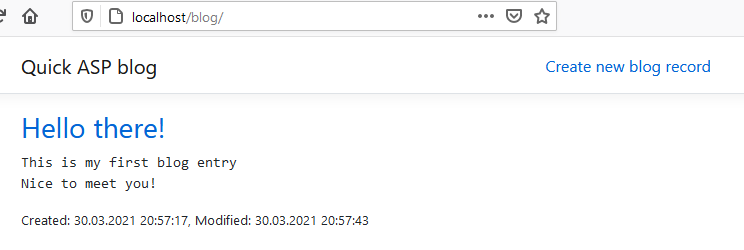

Simple blog on ASP.NET 5.0

## What is it
I want to start my blog (locally on laptop) and don't want to use ready-made solutions (for example, BlogEngine).

The idea was to create and run application on IIS as soon as possible.

It is very simple application, only list all posts and creation/edition/deletion for each one.

All posts stores in UTF-8 text files in application subfolder.

## Creation
I have Visual Studio 2019 with .NET 5.0 (Core).

Before that I had experience in creating web applications on ASP.NET Core 2 and ASP.NET MVC (.NET 4.0).

First, I create new project (ASP.NET Core Web Application) with Razor Pages content.

Then add/modify pages, add some code (not a lot of).

## Publication
I need to blog on my laptop at any time.

I decided to host on IIS (have Windows 10 with IIS 10).

Install hosting bundle, create new application pool, new site and publish application.

Encountered a problem launching the application (default web.config not working, made some [changes](web.config))
